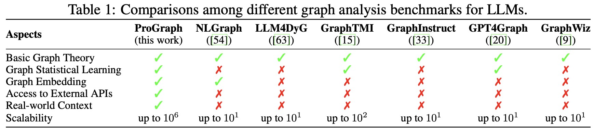
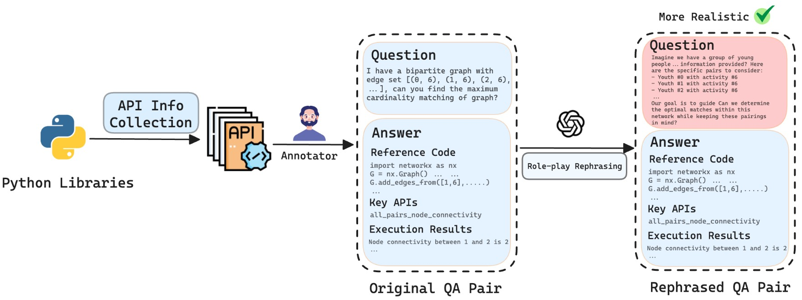
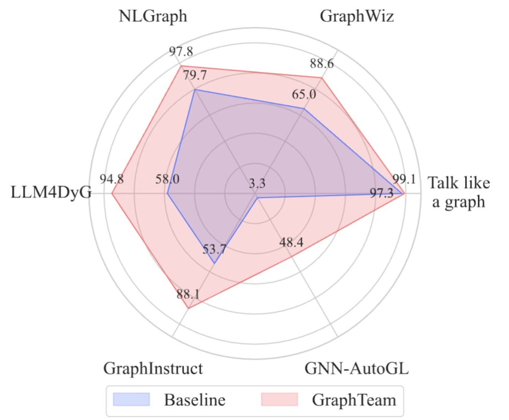

# ProGraph
Official Repository of "Can Large Language Models Analyze Graphs like Professionals? A Benchmark, Datasets and Models". NeurIPS 2024

- **Paper Link**: (https://arxiv.org/abs/2409.19667)
- **Huggingface Link(Models and Datasets)**: (https://huggingface.co/lixin4sky/ProGraph)

# Background



Table 1. Comparisons among different graph analysis benchmarks for LLMs.

Graphs are widely used data structures in the real world (e.g., social networks and recommendation systems). Enabling Large Language Models (LLMs) to process graphs is a key step toward more advanced artificial general intelligence. Recently, many researchers have proposed extending LLMs to scenarios requiring graph understanding and analysis. However, we believe existing research has the following main limitations:

- Existing work relies entirely on LLMs' step-by-step reasoning to solve problems. However, even with Chain of Thought (CoT) prompting, current LLMs' reasoning depth remains shallow. This means that when graph analysis tasks become complex, hallucinations or reasoning errors can easily occur, leading to task failure.

- Existing approaches require describing graph structures within prompts, which, due to context length limitations, cannot be applied to large-scale graph data processing.

- For open-source models like Llama, there is still a lack of instruction-tuning datasets focused on graph analysis and reasoning scenarios by coding, resulting in suboptimal performance.

- For closed-source models like ChatGPT, there is also a need to build external knowledge bases specifically for graph analysis and reasoning scenarios rather than relying solely on prompt engineering to improve model performance.

# Introduction


Figure 1: The pipeline of LLM4Graph dataset construction and corresponding model enhancement(left: close-source models, right: open-source models).

**Core Idea**: To address these limitations, we follow human experts' problem-solving approach and **propose for the first time a method that enables LLMs to solve graph analysis and reasoning problems through code generation**: For example, when calculating shortest paths in a million-node graph, human experts don't attempt to reason about the entire graph mentally, but rather call a few lines of code using Python libraries like NetworkX to solve the problem quickly and accurately. Specifically, when the model performs graph analysis tasks, we guide it to write code and call relevant Python libraries, after which we extract and execute the code from the model's response to obtain answers. This programming-based solution can read graph data from files, thereby bypassing LLMs' context length limitations and applying to graph data analysis at any scale.

To better improve LLMs' performance in writing code for graph analysis problems, we explored the following methods for capability enhancement:

- For open-source models, we constructed a Q&A dataset incorporating two-step chain-of-thought reasoning (first reasoning about which APIs to use, then writing code) and used instruction fine-tuning to teach models how to write code to solve problems.

- For closed-source models, we collected API documentation from six Python libraries including NetworkX, and then used Retrieval-Augmented Generation (RAG) technology to let models familiarize themselves with the documentation before answering questions and writing code based on it, thereby improving model performance.

- We analyzed the causes of code writing errors across different models. Based on these analyses, we can further improve both open-source and closed-source models' abilities to write code for solving graph analysis problems in the future.



Figure 2: The pipeline of ProGraph benchmark construction.

# Quickstart

- **Python Version**: 3.10.14


# Next Level

## GraphTeam: Facilitating Large Language Model-based Graph Analysis via Multi-Agent Collaboration

- **GraphTeam:** (https://arxiv.org/abs/2410.18032)
- **Github Link:** (https://github.com/BUPT-GAMMA/GraphTeam)



Figure 3. Performance Comparison of GraphTeam versus Baselines Across Six Benchmarks.

# Citation

```text
@misc{li2024largelanguagemodelsanalyze,
      title={Can Large Language Models Analyze Graphs like Professionals? A Benchmark, Datasets and Models}, 
      author={Xin Li and Weize Chen and Qizhi Chu and Haopeng Li and Zhaojun Sun and Ran Li and Chen Qian and Yiwei Wei and Zhiyuan Liu and Chuan Shi and Maosong Sun and Cheng Yang},
      year={2024},
      eprint={2409.19667},
      archivePrefix={arXiv},
      primaryClass={cs.CL},
      url={https://arxiv.org/abs/2409.19667}, 
}
```

```text
@misc{li2024graphteamfacilitatinglargelanguage,
      title={GraphTeam: Facilitating Large Language Model-based Graph Analysis via Multi-Agent Collaboration}, 
      author={Xin Li and Qizhi Chu and Yubin Chen and Yang Liu and Yaoqi Liu and Zekai Yu and Weize Chen and Chen Qian and Chuan Shi and Cheng Yang},
      year={2024},
      eprint={2410.18032},
      archivePrefix={arXiv},
      primaryClass={cs.AI},
      url={https://arxiv.org/abs/2410.18032}, 
}
```