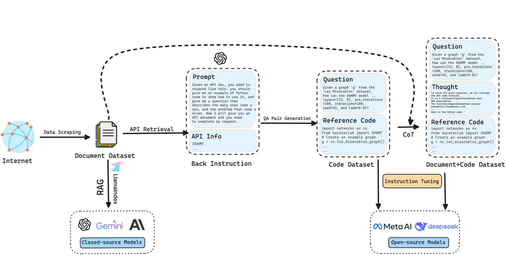

# ProGraph

Official Repository of "Can Large Language Models Analyze Graphs like Professionals? A Benchmark, Datasets and Models". NeurIPS 2024

- **Paper Link**: (https://arxiv.org/abs/2409.19667)
- **Models and Datasets**: (https://huggingface.co/lixin4sky/ProGraph)

# Background


Table 1. Comparisons among different graph analysis benchmarks for LLMs.

Graphs are widely used data structures in the real world (e.g., social networks and recommendation systems). Enabling Large Language Models (LLMs) to process graphs is a key step toward more advanced artificial general intelligence. Recently, many researchers have proposed extending LLMs to scenarios requiring graph understanding and analysis. However, we believe existing research has the following main limitations:

- Existing work relies entirely on LLMs' step-by-step reasoning to solve problems. However, even with Chain of Thought (CoT) prompting, current LLMs' reasoning depth remains shallow. This means that when graph analysis tasks become complex, hallucinations or reasoning errors can easily occur, leading to task failure.
- Existing approaches require describing graph structures within prompts, which, due to context length limitations, cannot be applied to large-scale graph data processing.
- For open-source models like Llama, there is still a lack of instruction-tuning datasets focused on graph analysis and reasoning scenarios by coding, resulting in suboptimal performance.
- For closed-source models like ChatGPT, there is also a need to build external knowledge bases specifically for graph analysis and reasoning scenarios rather than relying solely on prompt engineering to improve model performance.

# Introduction



Figure 1: The pipeline of LLM4Graph dataset construction and corresponding model enhancement(left: close-source models, right: open-source models).

**Core Idea**: To address these limitations, we follow human experts' problem-solving approach and **propose for the first time a method that enables LLMs to solve graph analysis and reasoning problems through code generation**: For example, when calculating shortest paths in a million-node graph, human experts don't attempt to reason about the entire graph mentally, but rather call a few lines of code using Python libraries like NetworkX to solve the problem quickly and accurately. Specifically, when the model performs graph analysis tasks, we guide it to write code and call relevant Python libraries, after which we extract and execute the code from the model's response to obtain answers. This programming-based solution can read graph data from files, thereby bypassing LLMs' context length limitations and applying to graph data analysis at any scale.

To better improve LLMs' performance in writing code for graph analysis problems, we explored the following methods for capability enhancement:

- For open-source models, we constructed a Q&A dataset incorporating two-step chain-of-thought reasoning (first reasoning about which APIs to use, then writing code) and used instruction fine-tuning to teach models how to write code to solve problems.
- For closed-source models, we collected API documentation from six Python libraries including NetworkX, and then used Retrieval-Augmented Generation (RAG) technology to let models familiarize themselves with the documentation before answering questions and writing code based on it, thereby improving model performance.
- We analyzed the causes of code writing errors across different models. Based on these analyses, we can further improve both open-source and closed-source models' abilities to write code for solving graph analysis problems in the future.


Figure 2: The pipeline of ProGraph benchmark construction.

# Quickstart

## 1. Create a New Python Virtual Environment

To avoid dependency conflicts, it's recommended to run the project in a new virtual environment. Follow these steps to create one:

### **Create new virtual environment**

```bash
conda create -n my_env python==3.10.14
```

- This command creates a virtual environment named `my_env` in the current directory.

### **Activate the Virtual Environment**

```bash
conda activate my_env 
```

---

## 2. Install Dependencies

With the virtual environment activated, use `pip` to install the project's required dependencies.

```bash
pip install -r requirements.txt
```

## **3: Set OpenAI API Key**

* **On Unix/Linux:**

  ```bash
  export OPENAI_API_KEY='your_api_key'
  export OPENAI_BASE_URL='your_base_url'
  export OPENAI_API_BASE='your_api_base'
  export GEMINI_API_KEY='your_gemini_api_key'          # Optional
  ```
* **On Windows (PowerShell):**

  ```bash
  $env:API_KEY='your_api_key'
  $env:BASE_URL='your_base_url'
  $env:OPENAI_API_BASE='your_api_base'
  $env:GEMINI_API_KEY='your_gemini_api_key'          # Optional
  ```

## 4. Run the `./execute.sh` Script

### **Edit Script Parameters**

Before running the script, you may need to edit the `execute.sh` file to set appropriate parameters based on your needs. For example, set `model_type`, `model_name`, and others.

```bash
# Open execute.sh and edit the following:

# Set the model type: 'closed' or 'open'
model_type="closed"  # Or set to 'open' depending on your model type

# Set required parameters
model_name="your_model_name"
# If using an open-source model, also set model_setting
# model_setting="your_model_setting"

# Set other optional parameters as needed
top_k=0
num_threads=5
lib_name=""
answer_difficulty=""
category=""
question_type=""
```

- **Note**:
  - For **closed-source models**, ensure you have filled in your **API key** and **`base_url`** in the corresponding Python script (e.g., `close_model.py`).
  - For **open-source models**, ensure you have downloaded the model and the corresponding **`model_settings`** file, and configured the paths correctly in the script.

### **Run the Script**

In the project's root directory, execute the following command to run the script:

```bash
./execute.sh
```

- The script will automatically perform the model inference and evaluation processes, including:
  - Running the inference script (`close_model.py` or `open_model.py`) to generate the model's inference results based on your settings.
  - Running the evaluation script (`1_run_test.py`) to evaluate the model's inference results.

---

## 4. Additional Notes

This shell script is designed to automate the process of running inference and evaluation for either closed-source or open-source models within the `graph_tool_agent` project. By adjusting the parameters within the script, you can customize the behavior to suit your specific needs.

The script performs the following steps:

1. **Set the Model Type**: Determines whether to use a closed-source or open-source model based on the `model_type` variable.
2. **Set Parameters**: Allows you to set required and optional parameters for the chosen modelConstructs and runs the appropriate Python script with the specified parameters.
3. **Execute the generated code**: Execute the code generated before.

### 1. Set the Model Type

```bash
model_type="closed"  # Change to 'open' if using an open-source model
```

- **Options**:
  - `"closed"`: Use a closed-source model.
  - `"open"`: Use an open-source model.
- **Action Required**: Set this variable to match the type of model you intend to use.

### 2. Conditional Execution Based on Model Type

#### For Closed-Source Models

```bash
if [ "$model_type" = "closed" ]; then
    # For closed-source model
    echo "Please ensure you have filled in your API key and base_url in close_model.py before proceeding."
```

- **Note**: Make sure to update `close_model.py` with your API key and `base_url` before running the script.

##### Set Parameters

```bash
    # Set default parameters (modify these as needed)
    model_name="gpt-4o-mini"       # Required: specify your model name
    top_k=0                        # Optional: integer between 0-9; 0 means no RAG
    num_threads=5                  # Optional: integer between 1-32
    lib_name=""              	   # Optional: specify the Python library name
    answer_difficulty=""           # Optional: specify the difficulty level
    category=""                    # Optional: specify the question category
    question_type=""               # Optional: specify the question type
```

- **Required Parameter**:
  - `model_name`: The name of the closed-source model you want to use.
- **Optional Parameters**:
  - `top_k`: Number between 0 and 9; `0` disables RAG (Retrieval-Augmented Generation).
  - `num_threads`: Number of threads to use; between 1 and 32.
  - `lib_name`: The Python library related to the questions (`"igraph"`, `"networkx"`, etc.).
  - `answer_difficulty`: Difficulty level of the questions (`"easy"`, `"hard"`).
  - `category`: Category of the questions. (`"basic graph theory"`, `"graph statistic learning"`, etc.).
  - `question_type`: Type of the questions (`"true/false"`, `"calculations"`, etc.).

#### For Open-Source Models

```bash
elif [ "$model_type" = "open" ]; then
    # For open-source model
    echo "Please ensure you have the model and model_settings before proceeding."
```

- **Note**: Make sure to download the model and `model_settings` before running the script.

##### Set Parameters

```bash
    # Set default parameters (modify these as needed)
    model_name="your_model_name"       # Required: specify your model name
    model_setting="your_model_setting" # Required: specify your model setting
    top_k=0                            # Optional: integer between 0-9; 0 means no RAG
    lib_name=""                        # Optional: specify the Python library name
    answer_difficulty=""               # Optional: specify the difficulty level
    category=""                        # Optional: specify the question category
    question_type=""                   # Optional: specify the question type
```

- **Required Parameters**:
  - `model_name`: The name of the open-source model you want to use.
  - `model_setting`: The model configuration or settings file.
- **Optional Parameters**: Same as for closed-source models.

### 3. Execute the generated code

```bash
cd ../evaluation/run
python 1_run_test.py
```

- Executes the `1_run_test.py` script to evaluate the model's performance.

# Next Level

## GraphTeam: Facilitating Large Language Model-based Graph Analysis via Multi-Agent Collaboration

- **GraphTeam:** (https://arxiv.org/abs/2410.18032)
- **Github Link:** (https://github.com/BUPT-GAMMA/GraphTeam)


Figure 3. Performance Comparison of GraphTeam versus Baselines Across Six Benchmarks.

# Citation

```text
@misc{li2024largelanguagemodelsanalyze,
      title={Can Large Language Models Analyze Graphs like Professionals? A Benchmark, Datasets and Models}, 
      author={Xin Li and Weize Chen and Qizhi Chu and Haopeng Li and Zhaojun Sun and Ran Li and Chen Qian and Yiwei Wei and Zhiyuan Liu and Chuan Shi and Maosong Sun and Cheng Yang},
      year={2024},
      eprint={2409.19667},
      archivePrefix={arXiv},
      primaryClass={cs.CL},
      url={https://arxiv.org/abs/2409.19667}, 
}
```

```text
@misc{li2024graphteamfacilitatinglargelanguage,
      title={GraphTeam: Facilitating Large Language Model-based Graph Analysis via Multi-Agent Collaboration}, 
      author={Xin Li and Qizhi Chu and Yubin Chen and Yang Liu and Yaoqi Liu and Zekai Yu and Weize Chen and Chen Qian and Chuan Shi and Cheng Yang},
      year={2024},
      eprint={2410.18032},
      archivePrefix={arXiv},
      primaryClass={cs.AI},
      url={https://arxiv.org/abs/2410.18032}, 
}
```

* **On Unix/Linux:**
  <pre class="!overflow-visible"><div class="contain-inline-size rounded-md border-[0.5px] border-token-border-medium relative bg-token-sidebar-surface-primary dark:bg-gray-950"><div class="flex items-center text-token-text-secondary px-4 py-2 text-xs font-sans justify-between rounded-t-md h-9 bg-token-sidebar-surface-primary dark:bg-token-main-surface-secondary">bash</div><div class="sticky top-9 md:top-[5.75rem]"><div class="absolute bottom-0 right-2 flex h-9 items-center"><div class="flex items-center rounded bg-token-sidebar-surface-primary px-2 font-sans text-xs text-token-text-secondary dark:bg-token-main-surface-secondary"><span class="" data-state="closed"><button class="flex gap-1 items-center py-1"><svg width="24" height="24" viewBox="0 0 24 24" fill="none" xmlns="http://www.w3.org/2000/svg" class="icon-sm"><path fill-rule="evenodd" clip-rule="evenodd" d="M7 5C7 3.34315 8.34315 2 10 2H19C20.6569 2 22 3.34315 22 5V14C22 15.6569 20.6569 17 19 17H17V19C17 20.6569 15.6569 22 14 22H5C3.34315 22 2 20.6569 2 19V10C2 8.34315 3.34315 7 5 7H7V5ZM9 7H14C15.6569 7 17 8.34315 17 10V15H19C19.5523 15 20 14.5523 20 14V5C20 4.44772 19.5523 4 19 4H10C9.44772 4 9 4.44772 9 5V7ZM5 9C4.44772 9 4 9.44772 4 10V19C4 19.5523 4.44772 20 5 20H14C14.5523 20 15 19.5523 15 19V10C15 9.44772 14.5523 9 14 9H5Z" fill="currentColor"></path></svg>复制代码</button></span></div></div></div><div class="overflow-y-auto p-4" dir="ltr"><code class="!whitespace-pre hljs language-bash">export API_KEY='your_api_key'
  export BASE_URL='your_base_url'
  export LLAMAINDEX_API_KEY='your_llamaindex_api_key'  # If applicable
  export GEMINI_API_KEY='your_gemini_api_key'          # Optional
  </code></div></div></pre>
* **On Windows (Command Prompt):**
  <pre class="!overflow-visible"><div class="contain-inline-size rounded-md border-[0.5px] border-token-border-medium relative bg-token-sidebar-surface-primary dark:bg-gray-950"><div class="flex items-center text-token-text-secondary px-4 py-2 text-xs font-sans justify-between rounded-t-md h-9 bg-token-sidebar-surface-primary dark:bg-token-main-surface-secondary">cmd</div><div class="sticky top-9 md:top-[5.75rem]"><div class="absolute bottom-0 right-2 flex h-9 items-center"><div class="flex items-center rounded bg-token-sidebar-surface-primary px-2 font-sans text-xs text-token-text-secondary dark:bg-token-main-surface-secondary"><span class="" data-state="closed"><button class="flex gap-1 items-center py-1"><svg width="24" height="24" viewBox="0 0 24 24" fill="none" xmlns="http://www.w3.org/2000/svg" class="icon-sm"><path fill-rule="evenodd" clip-rule="evenodd" d="M7 5C7 3.34315 8.34315 2 10 2H19C20.6569 2 22 3.34315 22 5V14C22 15.6569 20.6569 17 19 17H17V19C17 20.6569 15.6569 22 14 22H5C3.34315 22 2 20.6569 2 19V10C2 8.34315 3.34315 7 5 7H7V5ZM9 7H14C15.6569 7 17 8.34315 17 10V15H19C19.5523 15 20 14.5523 20 14V5C20 4.44772 19.5523 4 19 4H10C9.44772 4 9 4.44772 9 5V7ZM5 9C4.44772 9 4 9.44772 4 10V19C4 19.5523 4.44772 20 5 20H14C14.5523 20 15 19.5523 15 19V10C15 9.44772 14.5523 9 14 9H5Z" fill="currentColor"></path></svg>复制代码</button></span></div></div></div><div class="overflow-y-auto p-4" dir="ltr"><code class="!whitespace-pre hljs language-cmd">set API_KEY=your_api_key
  set BASE_URL=your_base_url
  set LLAMAINDEX_API_KEY=your_llamaindex_api_key  # If applicable
  set GEMINI_API_KEY=your_gemini_api_key          # Optional
  </code></div></div></pre>
* **On Windows (PowerShell):**
  <pre class="!overflow-visible"><div class="contain-inline-size rounded-md border-[0.5px] border-token-border-medium relative bg-token-sidebar-surface-primary dark:bg-gray-950"><div class="flex items-center text-token-text-secondary px-4 py-2 text-xs font-sans justify-between rounded-t-md h-9 bg-token-sidebar-surface-primary dark:bg-token-main-surface-secondary">powershell</div><div class="sticky top-9 md:top-[5.75rem]"><div class="absolute bottom-0 right-2 flex h-9 items-center"><div class="flex items-center rounded bg-token-sidebar-surface-primary px-2 font-sans text-xs text-token-text-secondary dark:bg-token-main-surface-secondary"><span class="" data-state="closed"><button class="flex gap-1 items-center py-1"><svg width="24" height="24" viewBox="0 0 24 24" fill="none" xmlns="http://www.w3.org/2000/svg" class="icon-sm"><path fill-rule="evenodd" clip-rule="evenodd" d="M7 5C7 3.34315 8.34315 2 10 2H19C20.6569 2 22 3.34315 22 5V14C22 15.6569 20.6569 17 19 17H17V19C17 20.6569 15.6569 22 14 22H5C3.34315 22 2 20.6569 2 19V10C2 8.34315 3.34315 7 5 7H7V5ZM9 7H14C15.6569 7 17 8.34315 17 10V15H19C19.5523 15 20 14.5523 20 14V5C20 4.44772 19.5523 4 19 4H10C9.44772 4 9 4.44772 9 5V7ZM5 9C4.44772 9 4 9.44772 4 10V19C4 19.5523 4.44772 20 5 20H14C14.5523 20 15 19.5523 15 19V10C15 9.44772 14.5523 9 14 9H5Z" fill="currentColor"></path></svg>复制代码</button></span></div></div></div><div class="overflow-y-auto p-4" dir="ltr"><code class="!whitespace-pre hljs language-powershell">$env:API_KEY='your_api_key'
  $env:BASE_URL='your_base_url'
  $env:LLAMAINDEX_API_KEY='your_llamaindex_api_key'  # If applicable
  $env:GEMINI_API_KEY='your_gemini_api_key'          # Optional
  </code></div></div></pre>

**Note:**

* Ensure there are no spaces around the `=` sign.
* Environment variables are session-specific. You need to set them again if you open a new terminal session. For a permanent setup, consider adding the export commands to your shell profile (e.g., `~/.bashrc` or `~/.zshrc` for Unix/Linux).
